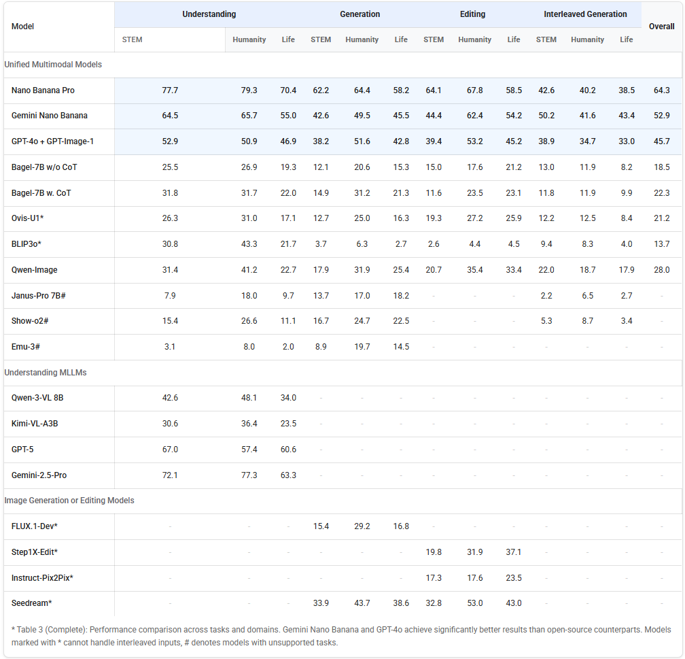

# AEGIS: Exploring the Limit of World Knowledge Capabilities for Unified Multimodal Models

The official code of the paper "[AEGIS: Exploring the Limit of World Knowledge Capabilities for Unified Multimodal Models](https://arxiv.org/abs/2601.00561)".

<div align="center">
    
</div>

The capability of Unified Multimodal Models (UMMs) to apply world knowledge across diverse tasks remains a critical, unresolved challenge. Existing benchmarks fall short, offering only siloed, single-task evaluations with limited diagnostic power. To bridge this gap, we propose **AEGIS** (Assessing Editing, Generation, Interpretation-Understanding for Super-intelligence), a comprehensive multi-task benchmark covering visual understanding, generation, editing, and interleaved generation. AEGIS comprises 1,050 challenging, manually-annotated questions spanning 21 topics (including STEM, humanities, daily life) and 6 reasoning types. To concretely evaluate UMM performance without ambiguous metrics, we propose **Deterministic Checklist-based Evaluation (DCE)**, a protocol utilizing atomic "Y/N" judgments. Our extensive experiments reveal that most UMMs exhibit severe world knowledge deficits and performance degrades significantly with complex reasoning.

<div align="center">

[\[🆕 Blog\]](https://m1saka.moe/aegis/)  [\[📜 ArXiv Paper\]](https://arxiv.org/abs/2601.00561)  [\[🤗 HF Datasets\]](https://huggingface.co/datasets/DongSky/AEGIS)

</div>

## 📖 Highlights

The main contributions of this work are as follows:

- **Comprehensive Multi-Task Benchmark**: Assesses Visual Understanding, Generation, Editing, and Interleaved Generation simultaneously.
- **Extensive Knowledge Coverage**: 1,050 questions across 21 topics (STEM, Humanities, Daily Life) and 6 reasoning types.
- **Deterministic Evaluation (DCE)**: A novel checklist-based protocol that replaces ambiguous scores with atomic "Yes/No" judgments for reliability.
- **In-depth Diagnosis**: Reveals severe world knowledge deficits in SOTA UMMs and the impact of reasoning complexity.

## 📊 Evaluation Results

We evaluated various Unified Multimodal Models (UMMs) and Single-Task Generative Models. Below is the overall performance comparison.

<div align="center">
    
</div>

## 🛠️ Installation

We adopt [Gemini-2.5-Pro](https://gemini.google.com/) as our evaluation tool. You can use the following command to install the Gemini API client.

```bash
conda create -n aegis python=3.11
conda activate aegis
pip install google-genai openai numpy tqdm Pillow
```

## 🤗 Data Preparation

We provide the manually-annotated data in the [HF Datasets](https://huggingface.co/datasets/DongSky/AEGIS). You should organize the data as follows in `data` directory:
```
aegis/
└── data/
    ├── annotation.json
    └──images/
        ├── activity/
        ├── anime/
        ├── ...
        ├── ...
        ├── physics/
        └── traffic/
```

## 🔍 Evaluation

You can use the following command to evaluate the model.

<details open>
<summary>Inference</summary>

```bash
# Use Gemini and GPT-4o for understanding task as an example
GEMINI_API_KEY="xxx" GEMINI_BASE_URL="xxx" python gemini/understanding.py --output-dir output-gemini
OPENAI_API_KEY="xxx" OPENAI_BASE_URL="xxx" python gpt/understanding.py --output-dir output-4o
```

</details>

<details open>
<summary>Evaluation</summary>

```bash
# Use understanding task as an example
GEMINI_API_KEY="xxx" GEMINI_BASE_URL="xxx" python eval/understanding.py --output-dir output-gemini
GEMINI_API_KEY="xxx" GEMINI_BASE_URL="xxx" python eval/understanding.py --output-dir output-4o
```

</details>

<details open>
<summary>Calculate Score</summary>

```bash
# Use understanding task as an example
python eval_score/understanding.py --input-json output-gemini/understanding_eval/gemini-2.5-pro_results.json
python eval_score/understanding.py --input-json output-4o/understanding_eval/gemini-2.5-pro_results.json
```

</details>

## 🎫 License

This project is released under the [MIT License](LICENSE).

## 📜 Citation

If you find this work helpful in your research, please consider citing:

```bibtex
@misc{aegis,
      title={AEGIS: Exploring the Limit of World Knowledge Capabilities for Unified Mulitmodal Models}, 
      author={Jintao Lin, Bowen Dong, Weikang Shi, Chenyang Lei, Suiyun Zhang, Rui Liu, Xihui Liu},
      year={2026},
      eprint={2601.00561},
      archivePrefix={arXiv},
      primaryClass={cs.CV},
      url={https://arxiv.org/abs/2601.00561}, 
}
```